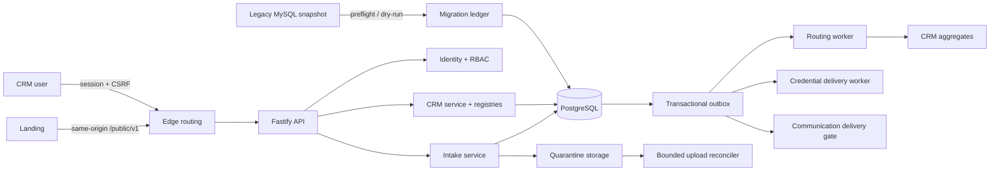

# Архитектура CRM Backend

## Цель

Снять с команды повторяемую обработку лидов и дать сотруднику контролируемое рабочее место, не
смешивая public intake, внутренние права, legacy migration и UI в один неразделимый контур.

## Слои

1. HTTP contracts — TypeBox schema, stable operationId, standard errors.
2. Application services — нормализация, authorization decision, state transition, pagination.
3. Ports — явные repository/storage/auth contracts.
4. Adapters — PostgreSQL, object storage, MySQL source.
5. Registries — operation/permission, dictionary, state machine, migration query/field maps.
6. Composition root — связывает реализации, не протекая в доменную логику.

## Консистентность

- Public write: idempotency claim + submission + outbox + audit — одна PostgreSQL transaction.
- Intake routing: outbox claim → inbox dedupe → CRM aggregate + source link + audit — одна transaction.
- CRM transition: `If-Match` → version check → aggregate/history/audit/outbox — одна transaction.
- Communication queue: approved draft + все получатели + audit + один outbox event + idempotency result —
  одна transaction; внешний provider не вызывается из HTTP request.
- Migration dry-run: immutable ledger key; повтор возвращает тот же outcome.

Object storage физически не участвует в PostgreSQL transaction, поэтому upload использует явный
durable lifecycle: DB reservation → stable object key → atomic finalize. Потеря acknowledgement после
COMMIT не приводит к удалению подтверждённого файла. Только bounded idempotent reconciler может
забирать просроченные неподтверждённые reservations и удалять orphan object; файл всё время остаётся
в quarantine и не парсится API-процессом.

## Масштабирование

- API stateless; session state находится в PostgreSQL.
- Cursor pagination сохраняет стабильный порядок `(created_at, id)`.
- Worker использует lease + `SKIP LOCKED`, поэтому масштабируется несколькими экземплярами.
- Outbox/inbox отделяет внешний delivery от транзакции CRM.
- Upload reconciler запускается как одноразовый maintenance job с bounded batch/retry windows; его
  можно безопасно планировать trusted scheduler-ом без параллельного ручного разбора.
- State machines и dictionaries versioned: исторический кейс остаётся на своей версии.

## Наблюдаемость

- Каждый HTTP response получает `X-Request-ID`.
- Логи редактируют cookie, authorization, password, token и personal payload.
- Readiness отдельно проверяет DB и object storage. DB check сверяет bundled migration manifest с
  read-only ledger и fail-closed возвращает not-ready при pending migration, checksum drift, пустом
  либо недоступном registry; API не выполняет DDL на readiness path.
- Storage readiness записывает и удаляет уникальный probe object; проверка существования каталога или
  bucket сама по себе не считается готовностью.
- Audit append-only и связан hash chain.
- Outbox сохраняет attempt/lock/error metadata без PII.

## Runtime privilege boundaries

- PostgreSQL bootstrap-superuser используется только внутри database container.
- `kurs_crm_migrator` владеет DDL и применяет checksum migrations.
- `kurs_crm_api`, `kurs_crm_worker` и `kurs_crm_credential_worker` имеют отдельные credentials.
  Migration `0130_runtime_least_privilege` оставляет routing worker точные verbs только на 13
  routing-таблицах и `EXECUTE` двух identity predicates, без sequence/default ACL и без доступа к
  sensitive identity tables. Runtime-ролям запрещены DDL и mutation schema-migration ledger.
- API — единственный процесс с session/MFA/PII/object-storage secrets. Worker получает только свой DB
  URL и параметры очереди, migrator — только свой DB URL.
- Edge передаёт backend только фактический `$remote_addr`; входящий от клиента `X-Forwarded-For`
  отбрасывается. Валидный edge `X-Request-ID` сохраняется сквозным.

## Осознанные human gates

Только человек утверждает contract interpretation, новый funnel version, конфликт identity/owner,
critical role/MFA recovery, malware-scanner/provider contracts и production cutover. Backend
обеспечивает durable queue, evidence и запрет неразрешённого либо не подтверждённого действия.
