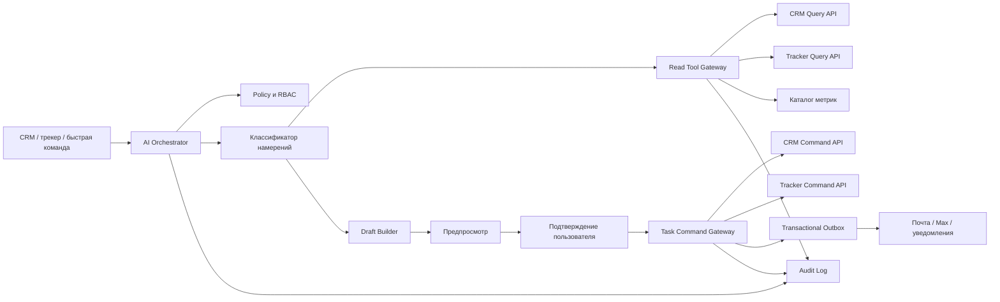

# ИИ-помощник для CRM и проектного трекера

## 1. Статус и граница решения

Этот документ фиксирует согласованное пользователем расширение продукта: ИИ должен не только отвечать в чате, но и помогать формировать отчёты и создавать задачи в CRM и проектном трекере.

В договоре ИИ описан кратко как текстовый помощник в CRM и проектном модуле. Поэтому приведённые ниже сценарии, контракты, требования безопасности и критерии приёмки являются продуктовой детализацией и расширением исходной формулировки. Их необходимо отдельно включить в уточнённое ТЗ, календарный план и приёмочные испытания.

ИИ не заменяет CRM, трекер, права доступа или бизнес-логику. Он является понятным разговорным интерфейсом к уже определённым данным и операциям системы.

## 2. Цель

Дать сотруднику, который не знаком с CRM, трекерами и формальными запросами, возможность за несколько секунд:

- понять текущее состояние работы;
- получить проверяемый отчёт по своим данным;
- создать одну или несколько задач простыми словами;
- увидеть, как система поняла запрос;
- исправить результат до сохранения;
- подтвердить действие осознанно.

Главный продуктовый принцип:

> Пользователь говорит о своей работе обычным языком, а система переводит запрос в прозрачный черновик, который можно проверить и подтвердить.

ИИ снимает рутину интерпретации, поиска, заполнения полей и составления текста. Человек сохраняет контроль над смыслом, приоритетом, ответственным, сроком, доступом и финальным действием.

## 3. Основные пользовательские задачи

### 3.1. В CRM

- «Покажи, сколько кандидатов сейчас ждут документы».
- «Кто из участников давно не получал ответа?»
- «Сделай отчёт по переездам за июль по муниципалитетам».
- «Создай задачу Анне: связаться с Ивановым завтра до 15:00».
- «Поставь задачи ответственным по всем сделкам без следующего шага».
- «Кратко перескажи историю этой сделки и выдели нерешённые вопросы».
- «Подготовь еженедельный отчёт руководителю, но пока не отправляй».

### 3.2. В проектном трекере

- «Что тормозит запуск нового раздела сайта?»
- «Собери отчёт по просроченным задачам проекта».
- «Создай задачу на проверку импорта и добавь критерии готовности».
- «Разбей эту цель на понятные шаги и покажи черновик».
- «Какие задачи требуют моего решения сегодня?»
- «Составь статус проекта для руководителя на одну страницу».

### 3.3. Для руководителя

- «Что изменилось с прошлого понедельника?»
- «Где есть риск срыва срока?»
- «Какие направления перегружены?»
- «Покажи только данные моего подразделения».
- «Сравни план и факт, объясни причины отклонений и приложи источники».

## 4. Принципы интерфейса для новичка

### 4.1. Не требовать умения писать промпты

На первом экране показываются не технические инструкции, а готовые человеческие действия:

- `Создать задачу`
- `Сделать отчёт`
- `Подвести итог`
- `Найти проблемы`
- `Что требует внимания`

Под строкой ввода отображаются короткие примеры, связанные с текущим экраном. На карточке сделки — примеры про сделку; в проекте — про задачи проекта; на дашборде — про отчёты.

### 4.2. Один запрос — один понятный результат

Система не должна перегружать пользователя длинным диалогом. Для типовой операции она:

1. понимает намерение;
2. заполняет известные поля из контекста;
3. спрашивает только действительно недостающие обязательные данные;
4. показывает готовый черновик;
5. предлагает одно основное действие.

### 4.3. Говорить языком работы, а не языком ИИ

В интерфейсе не используются слова `prompt`, `agent`, `tool call`, `temperature`, `context window` или `RAG`.

Допустимые формулировки:

- «Я подготовил черновик задачи».
- «Не указан ответственный».
- «Отчёт построен по 128 сделкам».
- «Три записи не вошли из-за отсутствующей даты».
- «Проверьте изменения перед сохранением».

### 4.4. Контекст должен быть видимым

Рядом со строкой ввода показывается область действия:

- `Эта сделка`
- `Проект «Новый сайт»`
- `Мои задачи`
- `Подразделение «Сопровождение»`
- `Вся доступная CRM`

Пользователь может изменить область до запуска. ИИ никогда не расширяет её скрытно.

### 4.5. Предсказуемость важнее эффектности

- никаких действий без явного подтверждения;
- никаких скрытых массовых изменений;
- никаких придуманных чисел, статусов или исполнителей;
- каждое число в отчёте ведёт к исходным записям;
- каждое созданное действие появляется в журнале;
- отменяемые операции должны иметь понятный путь отката.

## 5. Три интерфейсных сценария

### 5.1. Быстрая команда

Быстрая команда доступна из глобальной верхней панели и по сочетанию клавиш. Она предназначена для пользователя, который знает, что хочет сделать.

Пример:

> Создай задачу Марии связаться с работодателем по этой сделке в пятницу.

Поток:

1. Система получает текущий контекст: карточка сделки, пользователь, подразделение.
2. Определяет намерение `create_task`.
3. Находит упомянутого сотрудника только в разрешённой пользователю области.
4. Нормализует срок с учётом часового пояса и рабочего календаря.
5. Показывает компактную карточку:
   - название;
   - описание;
   - исполнитель;
   - срок;
   - приоритет;
   - связанная сделка;
   - уведомление.
6. Неоднозначные поля подсвечиваются.
7. Пользователь редактирует карточку или нажимает `Создать задачу`.
8. После выполнения система показывает ссылку на задачу и запись аудита.


### 5.2. Контекстный помощник

Помощник открывается в боковой панели внутри сделки, контакта, проекта или задачи. Он уже знает объект, но видит только данные, разрешённые текущему пользователю.

Типовые действия:

- `Кратко пересказать`
- `Что требует внимания`
- `Создать следующий шаг`
- `Подготовить статус`
- `Найти связанные задачи`

Ответ состоит из трёх слоёв:

1. короткий вывод;
2. факты и риски;
3. ссылки на записи-источники.

Если пользователь просит действие, помощник переключается из режима ответа в режим черновика. Контекстное действие проходит тот же путь подтверждения, что и быстрая команда.


### 5.3. Конструктор отчёта

Пользователь выбирает шаблон или описывает результат простыми словами:

> Покажи, сколько участников переехало по месяцам, сравни с планом и выдели муниципалитеты с отставанием.

Система показывает понятные параметры:

- период;
- набор данных;
- подразделение или проект;
- группировка;
- показатели;
- формат результата;
- включать ли персональные данные;
- сохранить ли шаблон.

До построения система отображает краткую интерпретацию:

> Период: январь–июль 2026. Область: доступные вам сделки воронки «Переезд». Группировка: месяц и муниципалитет. Показатели: план, факт, отклонение.

После подтверждения пользователь получает:

- основные показатели;
- таблицу;
- график, если он улучшает понимание;
- краткое текстовое резюме;
- предупреждения о качестве данных;
- время формирования;
- фильтры и формулы;
- ссылки на исходные записи;
- экспорт в согласованные форматы.


### 5.4. Массовое создание задач

Запрос вида «Поставь задачи ответственным по всем просроченным сделкам» никогда не выполняется сразу.

Система:

1. формирует выборку;
2. показывает количество затронутых объектов;
3. объясняет правило создания;
4. отображает несколько примеров;
5. отмечает исключения и конфликты;
6. предлагает скачать полный список;
7. требует отдельного подтверждения массовой операции;
8. выполняет задачи пакетно через идемпотентный шлюз;
9. показывает созданные, пропущенные и ошибочные записи;
10. позволяет повторить только ошибки.

## 6. Модель взаимодействия: черновик → проверка → подтверждение → выполнение

Для любых изменений действует единый протокол.

### 6.1. Черновик

ИИ преобразует естественный язык в типизированное намерение. На этом шаге ничего не меняется в CRM или трекере.

### 6.2. Проверка

Система независимо от модели проверяет:

- права пользователя;
- допустимую область данных;
- существование связанных объектов;
- обязательные поля;
- значения справочников;
- срок и часовой пояс;
- лимит массовой операции;
- отсутствие дубликата;
- бизнес-правила CRM или трекера.

### 6.3. Предпросмотр

Пользователь видит не текстовое обещание, а точную карточку будущего изменения. Для массовой операции показывается количество объектов и правило формирования.

### 6.4. Подтверждение

Подтверждение привязано к неизменяемому хэшу черновика. Если после предпросмотра данные изменились, система требует повторного подтверждения.

### 6.5. Выполнение

Операция проходит только через штатный командный шлюз системы. Модель не получает прямого доступа на запись в базу.

### 6.6. Аудит

Сохраняются:

- кто инициировал запрос;
- исходная формулировка в допустимом для хранения виде;
- распознанное намерение;
- использованный контекст;
- версия правил и модели;
- подтверждённый черновик;
- результат выполнения;
- ошибки;
- ссылки на созданные объекты;
- время каждого шага.

## 7. Архитектурное решение



### 7.1. AI Orchestrator

Отвечает за:

- сбор минимально необходимого контекста;
- определение намерения;
- управление уточнениями;
- вызов только разрешённых инструментов;
- построение типизированного черновика;
- формирование понятного объяснения;
- трассировку запроса.

Поставщик языковой модели скрывается за адаптером. Это позволяет менять модель без переписывания доменных контрактов и не связывает бизнес-логику с одним провайдером.

### 7.2. Read Tool Gateway

Единственная точка чтения данных для ИИ. Шлюз предоставляет узкие типизированные операции, например:

- `get_deal_summary`
- `list_deals`
- `get_contact_timeline`
- `list_tasks`
- `get_project_status`
- `query_metric`
- `resolve_user`
- `resolve_entity`

Шлюз:

- применяет RBAC до выполнения запроса;
- ограничивает число строк;
- маскирует запрещённые поля;
- возвращает идентификаторы источников и время актуальности;
- запрещает произвольный SQL;
- логирует каждое чтение.

### 7.3. Task Command Gateway

Единственная точка записи для ИИ-сценариев. В первой версии шлюз поддерживает только создание задач.

Он:

- принимает типизированную команду, а не свободный текст;
- повторно проверяет права и бизнес-правила;
- проверяет токен подтверждения;
- поддерживает идемпотентность;
- создаёт запись аудита;
- пишет событие в transactional outbox;
- возвращает канонический результат из CRM или трекера.

Прямой доступ модели к `INSERT`, `UPDATE`, ORM-репозиториям и административным API запрещён.

### 7.4. Каталог метрик

Отчёты строятся только из зарегистрированных показателей. Для каждого показателя фиксируются:

- название для пользователя;
- бизнес-определение;
- формула;
- источник;
- допустимые фильтры и группировки;
- часовой пояс;
- правила обработки пустых значений;
- владелец показателя;
- версия;
- дата ввода;
- ограничения доступа.

ИИ выбирает подходящие метрики и объясняет их, но не придумывает формулы.

## 8. Типизированные намерения и контракты

Намерения отделены от диалогового текста. Минимальный набор первой версии:

- `create_task`
- `generate_report`
- `summarize_context`
- `find_attention_items`
- `clarify_request`
- `unsupported_request`

### 8.1. Создание задачи

```ts
type EntityRef = {
  entityType: "deal" | "contact" | "company" | "project" | "task";
  entityId: string;
  displayName: string;
};

type CreateTaskIntent = {
  kind: "create_task";
  title: string;
  description?: string;
  assigneeId?: string;
  dueAt?: string;
  priority?: "low" | "medium" | "high";
  relatedEntities: EntityRef[];
  checklist?: string[];
  notificationPolicy?: "default" | "silent";
  confidence: {
    overall: number;
    ambiguousFields: string[];
  };
};
```

Обязательные поля для выполнения определяет доменный сервис, а не модель. Если не указан исполнитель или срок и это обязательно по правилам проекта, система задаёт один короткий уточняющий вопрос.

### 8.2. Отчёт

```ts
type ReportIntent = {
  kind: "generate_report";
  metricIds: string[];
  dateRange: {
    from: string;
    to: string;
    timezone: string;
  };
  scope: {
    funnelIds?: string[];
    projectIds?: string[];
    departmentIds?: string[];
    assigneeIds?: string[];
  };
  dimensions: string[];
  filters: Array<{
    field: string;
    operator: "eq" | "in" | "gte" | "lte" | "is_empty";
    value: unknown;
  }>;
  comparison?: {
    type: "previous_period" | "plan_fact";
  };
  output: {
    table: boolean;
    chart?: "line" | "bar" | "stacked_bar";
    narrative: boolean;
  };
};
```

### 8.3. Черновик команды

```ts
type TaskCommandDraft = {
  draftId: string;
  draftHash: string;
  expiresAt: string;
  command: CreateTaskIntent;
  validation: {
    status: "valid" | "needs_input" | "blocked";
    warnings: string[];
    errors: string[];
  };
  authorization: {
    allowed: boolean;
    scopeLabel: string;
  };
};
```

### 8.4. Подтверждение

```ts
type ConfirmTaskCommand = {
  draftId: string;
  draftHash: string;
  confirmationToken: string;
  idempotencyKey: string;
};
```

## 9. Семантика и доказательность отчётов

ИИ-отчёт состоит из двух независимых частей:

1. вычисляемые данные, полученные детерминированным запросом;
2. текстовое объяснение, сформированное на основе этих данных.

Модель не выполняет арифметику вместо отчётного сервиса и не создаёт показатели из текста.

Каждый отчёт сохраняет воспроизводимую спецификацию:

- версию метрик;
- набор фильтров;
- область данных;
- период и часовой пояс;
- дату и время снимка;
- число учтённых записей;
- число исключённых записей;
- причины исключения;
- идентификатор запроса;
- ссылки на исходные объекты.

В интерфейсе рядом с числом доступны:

- `Как посчитано`
- `Показать записи`
- `Качество данных`

Если данных недостаточно, система пишет «Недостаточно данных» и объясняет причину. Она не заменяет отсутствие данных предположением.

Персональные данные не включаются в отчёт по умолчанию. Их вывод требует подходящей роли и явного выбора пользователя.

## 10. Права, область и персональные данные

### 10.1. Наследование прав

ИИ видит и изменяет только то, что доступно пользователю через обычный интерфейс. Для него не создаётся отдельная «сверхроль».

Проверка выполняется:

- при выборе контекста;
- перед каждым чтением;
- при построении черновика;
- непосредственно перед выполнением команды.

### 10.2. Ограничение области

Каждый запрос содержит серверно сформированный `scope`, который нельзя расширить текстом пользователя или инструкцией внутри данных.

Примеры областей:

- текущая карточка;
- конкретный проект;
- свои задачи;
- подразделение;
- разрешённые воронки;
- вся доступная пользователю система.

### 10.3. Минимизация данных

В модель передаются только поля, необходимые для запроса. Пароли, токены, секреты интеграций, служебные ключи и неиспользуемые персональные данные не передаются никогда.

Для внешнего поставщика модели должны быть зафиксированы:

- запрет использования данных для обучения;
- допустимый регион обработки;
- срок хранения или режим без хранения;
- шифрование;
- журнал обращений;
- процедура удаления;
- договорные требования к конфиденциальности.

### 10.4. Защита от prompt injection

Текст из сделок, комментариев, файлов и писем считается недоверенными данными, а не инструкциями.

Система:

- отделяет системные правила от пользовательского содержимого;
- не исполняет команды, обнаруженные внутри документов;
- разрешает только заранее зарегистрированные инструменты;
- проверяет аргументы инструментов по схеме;
- блокирует попытки расширить права;
- ограничивает объём и число вызовов;
- журналирует подозрительные запросы.

## 11. Идемпотентность, уведомления и согласованность

Каждая подтверждённая команда получает `idempotencyKey`. Повторный запрос с тем же ключом возвращает ранее созданный результат и не создаёт дубликат.

Создание задачи и событие для уведомления фиксируются в одной транзакционной границе через transactional outbox:

1. доменная команда создаёт задачу;
2. в той же транзакции записывается событие;
3. отдельный обработчик доставляет уведомление;
4. повторная доставка безопасна;
5. статус доставки виден в журнале.

Если уведомление в почту или Max не отправилось, задача остаётся созданной, а система:

- показывает отдельный статус доставки;
- повторяет отправку по политике;
- позволяет оператору повторить только уведомление;
- не дублирует задачу.

Для массовой операции используется пакетный идентификатор. Результат содержит состояние каждого элемента: `created`, `skipped`, `conflict`, `failed`.

## 12. Ошибки и безопасные запасные сценарии

### 12.1. Низкая уверенность

Если система не уверена в исполнителе, дате, проекте или объекте связи, она не угадывает. Она показывает варианты или задаёт один уточняющий вопрос.

### 12.2. Недоступная операция

Если пользователь просит действие, которое не поддерживается:

> Я пока не могу изменить этап сделки. Могу показать текущий этап или подготовить задачу ответственному.

### 12.3. Недостаточно прав

Система не раскрывает существование закрытых объектов:

> У вас нет доступа для выполнения этой операции в выбранной области.

### 12.4. Изменившиеся данные

Если объект изменился после предпросмотра:

> Данные обновились после подготовки черновика. Я пересобрал результат — проверьте его ещё раз.

### 12.5. Недоступность модели

Основные CRM и трекер продолжают работать без ИИ. Интерфейс показывает:

> Помощник временно недоступен. Вы можете создать задачу обычной формой.

ИИ не должен быть обязательной точкой отказа для базовых операций.

### 12.6. Ошибка частичной массовой операции

Система не сообщает общий успех, если часть команд завершилась ошибкой. Она показывает точные количества и предлагает повторить только неуспешные элементы.

## 13. Наблюдаемость и эксплуатация

Для каждого запроса формируется `traceId`. Метрики не должны содержать сырой текст с персональными данными.

Необходимые технические показатели:

- доступность оркестратора;
- p50/p95 времени до первого результата;
- p50/p95 времени построения отчёта;
- доля успешной классификации намерения;
- число уточняющих вопросов;
- доля принятых, изменённых и отменённых черновиков;
- процент ошибок шлюзов;
- повторы по idempotency key;
- доставка outbox-событий;
- стоимость по сценарию и подразделению;
- доля ответов с полным набором источников;
- случаи блокировки политиками безопасности.

Продуктовые показатели:

- время от запроса до созданной задачи;
- время подготовки регулярного отчёта;
- доля пользователей, завершивших сценарий без обучения;
- частота ручных исправлений исполнителя, срока и связи;
- число действий, отменённых после предпросмотра;
- снижение числа сделок без следующего шага;
- снижение времени на еженедельную отчётность.

Для команды поддержки нужен экран диагностики:

- идентификатор запроса;
- этап, на котором произошла ошибка;
- версия модели и промпта;
- вызванные инструменты без секретов;
- решение policy engine;
- результат доменной команды;
- статус уведомлений.

## 14. Оценка качества

Перед выпуском формируется обезличенный тестовый набор реальных пользовательских формулировок:

- короткие и неполные запросы;
- опечатки;
- разговорные даты;
- одинаковые имена сотрудников;
- несколько объектов в одном запросе;
- запросы за пределами прав;
- провокации на раскрытие данных;
- массовые операции;
- отсутствующие и противоречивые данные;
- длинные истории сделок;
- запросы на неподдерживаемые действия.

Оценка разделяется на независимые уровни:

1. правильность определения намерения;
2. правильность извлечения полей;
3. соблюдение области и RBAC;
4. правильность доменной валидации;
5. точность расчётов;
6. полнота источников;
7. понятность интерфейсного текста;
8. безопасность выполнения;

Изменение модели, системных инструкций, схем инструментов или каталога метрик запускает регрессионный набор автоматически.

## 15. Критерии приёмки

### 15.1. Безопасность

- Ни одна команда записи не выполняется без подтверждённого актуального черновика.
- Все тесты обхода RBAC и расширения области завершаются отказом.
- Модель не имеет прямого доступа к базе данных и командным API.
- Пароли, токены и секреты не передаются в модель и не попадают в логи.
- Инструкции внутри пользовательских данных не могут вызвать инструмент или изменить правила.

### 15.2. Создание задач

- В 100% выполненных команд заполнены обязательные поля доменной модели.
- Повтор подтверждённой команды с тем же ключом не создаёт дубликат.
- Созданная задача связана с правильным объектом и доступна по ссылке из результата.
- Изменение черновика после предпросмотра требует нового подтверждения.
- Массовая операция показывает точное число целей до выполнения.
- Частичный сбой отображается поэлементно и может быть безопасно повторён.

### 15.3. Отчёты

- Все числовые показатели поступают из детерминированного отчётного сервиса.
- Каждый показатель имеет формулу, версию и владельца.
- Каждый отчёт содержит период, область, фильтры, время снимка и количество записей.
- Арифметика совпадает с эталонными SQL/API-расчётами во всех приёмочных наборах.
- Все содержательные выводы имеют ссылки на исходные данные либо явно помечены как интерпретация.
- Неполные данные отображаются как ограничение, а не скрываются.

### 15.4. Удобство для новичка

При модерируемом тестировании сотрудник без опыта работы с CRM должен без подсказки ведущего:

- создать задачу из карточки сделки;
- исправить исполнителя в черновике;
- понять, что произойдёт после подтверждения;
- построить отчёт по готовому шаблону;
- открыть записи, из которых рассчитан показатель;
- отказаться от операции до выполнения.

Целевые показатели первой версии:

- не менее 90% участников завершают типовой сценарий;
- медианное время создания простой задачи — до 60 секунд;
- не более одного обязательного уточняющего вопроса в типовом сценарии;
- 100% участников замечают массовый характер операции до подтверждения;
- интерфейс работает с клавиатуры и соответствует WCAG 2.2 AA для основных сценариев.

### 15.5. Производительность

При штатной нагрузке:

- предпросмотр простой задачи — p95 до 5 секунд;
- краткое резюме одной карточки — p95 до 8 секунд;
- стандартный отчёт по агрегированным данным — p95 до 15 секунд;
- длительная операция показывает прогресс и не блокирует основной интерфейс.

Точные значения уточняются после нагрузочного профиля и замеров на целевой инфраструктуре.

## 16. Поэтапная реализация

### Этап 0. Доменная подготовка

- утвердить список намерений первой версии;
- определить обязательные поля задач;
- создать каталог метрик;
- формализовать RBAC и области;
- определить политику персональных данных;
- подготовить аудит и тестовый набор;
- согласовать интерфейсные макеты 06–08.

Без этого этапа модель будет автоматизировать неопределённость.

### Этап 1. Безопасный режим чтения

- контекстное резюме сделки и проекта;
- поиск объектов в доступной области;
- «что требует внимания»;
- отчёты по утверждённым метрикам;
- источники и качество данных;
- отсутствие операций записи.

Этот этап даёт раннюю пользу и позволяет проверить качество данных после миграции.

### Этап 2. Создание одной задачи

- быстрая команда;
- контекстный сценарий;
- типизированный черновик;
- предпросмотр и редактирование;
- подтверждение;
- идемпотентный командный шлюз;
- аудит;
- outbox-уведомления.

### Этап 3. Массовые задачи и шаблоны отчётов

- выборка и предпросмотр;
- пакетное выполнение;
- поэлементный результат;
- повтор ошибок;
- сохранённые шаблоны;
- регулярное автоматическое формирование отчёта.

Автоматически сформированный отчёт может быть доставлен адресатам только после отдельно настроенного правила с владельцем, расписанием, областью и возможностью отключения.

### Этап 4. Помощь в планировании

- разбиение цели на черновик задач;
- предложение зависимостей;
- выявление рисков;
- сравнение плана и факта;
- рекомендации следующего шага.

Даже на этом этапе ИИ предлагает план, но не создаёт и не переназначает набор задач без подтверждения человека.

## 17. Что автоматизируется сразу

- распознавание намерения;
- извлечение сроков, исполнителей и связей;
- поиск доступных объектов;
- заполнение черновика задачи;
- нормализация дат и справочников;
- сбор данных для отчёта;
- применение утверждённых формул;
- формирование краткого резюме;
- добавление источников;
- проверка обязательных полей;
- аудит и трассировка;
- безопасный повтор уведомлений;
- регрессионные проверки качества ИИ.

## 18. Что остаётся под контролем человека

- цель запроса;
- выбор области данных;
- интерпретация неоднозначного запроса;
- исполнитель, срок и приоритет;
- подтверждение создания задачи;
- подтверждение массовой операции;
- владелец и формула бизнес-метрики;
- включение персональных данных в отчёт;
- финальная оценка причин и рисков;
- настройка автоматической доставки;
- критические управленческие решения.

## 19. Риски и меры управления

| Риск | Последствие | Мера |
|---|---|---|
| Неопределённые бизнес-процессы | ИИ ускоряет хаос | Сначала каталог намерений, полей и метрик |
| Ошибочное понимание запроса | Неверная задача | Типизированный черновик и подтверждение |
| Придуманные цифры | Потеря доверия | Детерминированный отчётный сервис |
| Утечка персональных данных | Юридический и репутационный риск | RBAC, минимизация, маскирование, аудит |
| Скрытая массовая операция | Массовые ошибочные задачи | Отдельный предпросмотр и подтверждение |
| Дубликаты при повторе | Операционный шум | Идемпотентность |
| Сбой уведомления | Исполнитель не узнаёт о задаче | Transactional outbox и повтор доставки |
| Prompt injection в комментарии или файле | Обход правил | Недоверенный контент, allowlist инструментов |
| Зависимость от одного поставщика модели | Стоимость и риск остановки | Адаптер модели и доменные контракты |
| Низкое качество исходных данных | Неверные выводы | Индикатор качества и отчёт об исключениях |
| Слишком сложный интерфейс | Новички не используют функцию | Шаблоны, один главный шаг, UX-тестирование |

## 20. Решения, которые нужно утвердить до разработки

1. Какие роли могут создавать задачи через ИИ.
2. Какие поля задачи обязательны в CRM и в проектном трекере.
3. Допустимо ли создание задачи без срока или исполнителя.
4. Какой максимальный размер массовой операции доступен каждой роли.
5. Какие отчёты и метрики входят в первую версию.
6. Кто является владельцем каждой метрики.
7. Какие данные разрешено передавать поставщику модели.
8. Требуется ли развёртывание модели в закрытом контуре.
9. Где хранится история запросов и каков срок хранения.
10. Какие каналы уведомлений входят в первую версию.
11. Кто может настраивать регулярную доставку отчётов.
12. Какие действия, кроме создания задач, могут появиться в следующих версиях.

## 21. Рекомендуемый объём первой версии

Чтобы быстро дать ценность без опасной автономности, первая версия должна включать:

- одну универсальную строку быстрой команды;
- контекстного помощника в карточке сделки и проекта;
- резюме и поиск проблем;
- 5–8 утверждённых шаблонов отчётов;
- создание одной задачи через редактируемый черновик;
- ссылки на источники;
- RBAC, аудит, идемпотентность и outbox;
- обезличенный набор регрессионных тестов;
- продуктовую аналитику завершения сценариев.

Из первой версии следует исключить:

- автономное изменение этапов сделок;
- удаление объектов;
- отправку массовых сообщений без отдельного согласования;
- автоматическое назначение ответственных;
- самостоятельное изменение сроков существующих задач;
- выполнение произвольного SQL;
- свободный доступ к файлам и интеграционным секретам;
- неограниченные цепочки действий.

Такой объём позволяет сделать ИИ действительно быстрым и дружелюбным для новичка, сохраняя прозрачность и управляемость системы.
